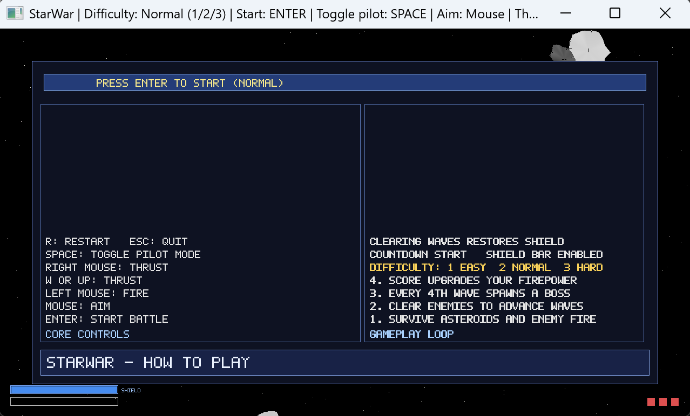
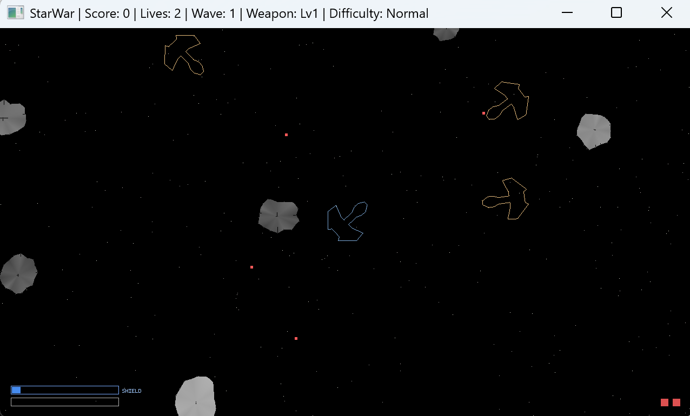
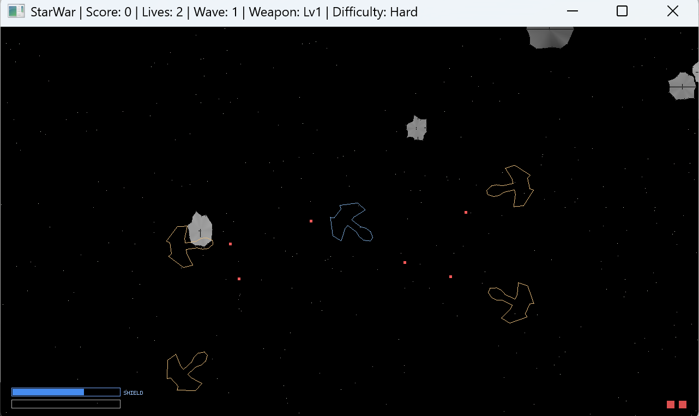

# StarWar

English is the primary documentation entry point.

A small open-source 2D space shooter built with modern C++17, OpenGL, and GLFW.

## Screenshots

> Place screenshots under `docs/images/`.

## Features

- Modern `C++17` codebase with clean module boundaries
- Fast gameplay loop with asteroids, enemy ships, and boss waves
- Progressive enemy roster including elite variants on higher waves
- Difficulty selection: `Easy`, `Normal`, `Hard`
- Score, shield, lives, and weapon progression systems
- GitHub Actions automated Windows build and release packaging

## Documentation

- English (full guide): [docs/README.en-US.md](docs/README.en-US.md)
- 简体中文（完整指南）: [docs/README.zh-CN.md](docs/README.zh-CN.md)
- 日本語（完全ガイド）: [docs/README.ja-JP.md](docs/README.ja-JP.md)

## Quick Start (Players - Windows)

1. Go to **Releases** on GitHub
2. Download `StarWar-<version>-Windows-Playable.zip`
3. Unzip it and run `StarWar.exe`
4. On start screen, pick difficulty with `1/2/3`
5. Press `Enter`, wait for countdown, then start

## Controls

| Action | Key / Mouse |
|---|---|
| Select difficulty | `1` / `2` / `3` |
| Start battle | `Enter` |
| Aim | Mouse |
| Fire | Left mouse |
| Thrust | `W` / `Up Arrow` / Right mouse |
| Toggle pilot mode | `Space` |
| Pause / Resume | `P` |
| Save current frame | `F12` |
| Toggle debug/perf overlay | `F3` |
| Restart run | `R` |
| Toggle audio | `M` |
| Toggle minimap | `Tab` |
| Quit | `Esc` |

## Build from Source (Developers)

1. Open `StarWar.sln`
2. Select `x64` and `Debug` or `Release`
3. Build and run project `main`
4. In-game, press `Enter` to launch from the start/help screen

## Automatic Build/Release

- Workflow: `.github/workflows/release-windows.yml`
- Every push builds a downloadable artifact (`StarWar-Windows-Playable`)
- Tags like `v1.0.0` publish a release zip asset automatically

## Automation Modes (CLI)

- `--selftest_assets`: validate that required images (for example `assets/earth.png`) can be loaded, then exit.
- `--smoketest=<seconds>`: run a timed smoke session, save the last frame to `artifacts/smoketest-last-frame.ppm`, then exit.
- `--seed=<unsigned>`: run with deterministic RNG for reproducible gameplay and smoke captures.

## Full Validation (Local)

- Run `tools/run-full-validation.ps1` to execute build + unit tests + runtime self-test + smoke-test + package validation in one command.

## Project Structure

- `main/` - game executable and gameplay loop
- `draw2d/` - software rasterization and drawing primitives
- `support/` - runtime/configuration helpers
- `vmlib/` - math primitives (`Vec2f`, `Mat22f`)
- `third_party/` - vendored dependencies
- `docs/` - multilingual documentation

## Troubleshooting

- If the game exits immediately after launch, update GPU drivers first.
- If the issue remains, open an issue with your GPU model, OS version, and release tag.

## License

This project is licensed under the MIT License. See `LICENSE`.
